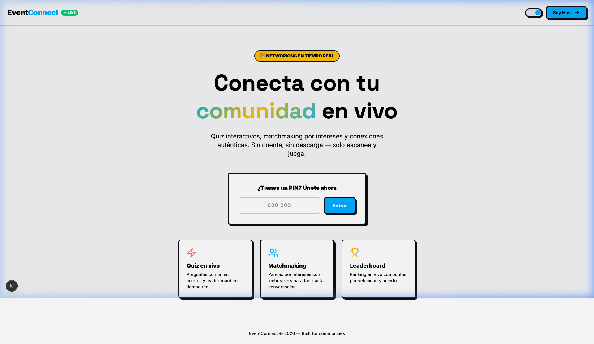

# EventConnect 🎉

**Plataforma de networking en tiempo real para eventos y comunidades.**

EventConnect permite a los hosts crear sesiones interactivas donde los asistentes participan en quiz en vivo, matchmaking por intereses y votaciones — sin necesidad de cuenta ni descarga. Solo un PIN y ya están dentro.



---

## ✨ Funcionalidades principales

| Módulo | Descripción |
|---|---|
| 🎯 **Quiz en vivo** | Preguntas de opción múltiple con timer, puntaje por acierto y leaderboard en tiempo real |
| 🤝 **Matchmaking** | Emparejamiento o grupos por intereses con icebreakers para facilitar la conversación |
| 📊 **Votaciones & Polls** | Encuestas y nubes de palabras para conocer la opinión de la audiencia |
| 🏆 **Leaderboard** | Ranking en vivo con puntos acumulados durante la sesión |
| 📱 **Sin fricción** | Los asistentes entran con un PIN de 6 dígitos — sin cuenta, sin descarga |

---

## 🛠️ Stack tecnológico

- **Framework:** [Next.js 15](https://nextjs.org) (App Router)
- **Base de datos & Auth:** [Supabase](https://supabase.com) (PostgreSQL + Realtime + Auth)
- **Estilos:** Vanilla CSS + Tailwind CSS (Neobrutalism design system)
- **Lenguaje:** TypeScript

---

## 🚀 Cómo ejecutarlo localmente

### 1. Clona el repositorio

```bash
git clone https://github.com/tu-usuario/event-connect.git
cd event-connect
```

### 2. Instala las dependencias

```bash
npm install
```

### 3. Configura las variables de entorno

Crea un archivo `.env.local` en la raíz del proyecto:

```env
NEXT_PUBLIC_SUPABASE_URL=https://tu-proyecto.supabase.co
NEXT_PUBLIC_SUPABASE_ANON_KEY=eyJ...
SUPABASE_SERVICE_ROLE_KEY=eyJ...
NEXT_PUBLIC_APP_URL=http://localhost:3000
```

> Puedes obtener estas credenciales desde el dashboard de tu proyecto en [supabase.com](https://supabase.com).

### 4. Inicializa la base de datos

En el **SQL Editor** de Supabase, ejecuta en orden los archivos de la carpeta `supabase/migrations/`:

```
001_initial.sql
002_...
003_enable_realtime.sql
004_group_matching.sql
```

### 5. Inicia el servidor de desarrollo

```bash
npm run dev
```

Abre [http://localhost:3000](http://localhost:3000) en tu navegador.

---

## 🏗️ Estructura del proyecto

```
event-connect/
├── app/
│   ├── (host)/          # Dashboard, crear sesión, vista en vivo del host
│   ├── (player)/        # Flujo del participante (join, play)
│   └── api/             # API Routes (sessions, activities, participants, etc.)
├── components/
│   ├── host/            # Componentes del panel del host
│   ├── player/          # Componentes de la vista del jugador
│   └── shared/          # Countdown, EmojiPicker, etc.
├── lib/
│   ├── realtime/        # Hooks de Supabase Realtime
│   ├── supabase/        # Clientes (client/server)
│   └── utils/           # Utilidades (pin, qr, matching)
└── supabase/
    └── migrations/      # Scripts SQL de inicialización
```

---

## 👤 Roles

- **Host** — Accede con cuenta de Supabase Auth. Crea sesiones, lanza actividades y controla el flujo del evento desde el panel.
- **Participante** — Entra sin cuenta usando el PIN de 6 dígitos. Responde quizzes, se empareja y vota en tiempo real.

---

## 📄 Licencia

MIT © 2026 EventConnect
